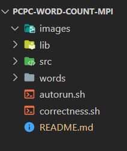
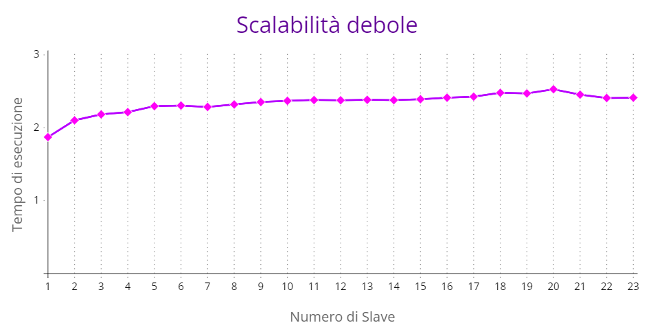
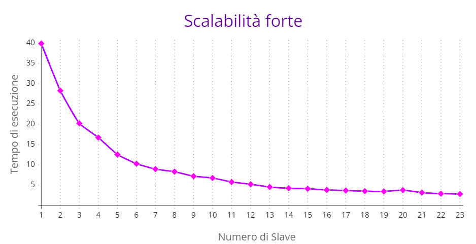

# PCPC-Word-Count-MPI

**PCPC-Word-Count-MPI** è un programma che permette di contare le parole di un testo in modo parallelo. Il conteggio delle parole è una pratica comune, soprattutto quando si deve rispettare un limite di parole specifico nel testo. L'implementazione parallela di PCPC-Word-Count-MPI consente di elaborare il testo in modo più rapido utilizzando più processori o nodi di calcolo contemporaneamente. In questo modo, il conteggio delle parole può essere effettuato in modo efficiente anche su testi molto lunghi.

## Esecuzione

Operazioni necessarie per l'esecuzione del programma.

### Requisiti

* Docker

### Installazione

* Ubuntu e OSX:
  ``` sh
  docker run -it --mount src="$(pwd)",target=/home type=bind spagnuolocarmine/docker-mpi:latest
  ```
* Windows: 
  ``` sh
  docker run -it --mount src="%cd%",target=/home,type=bind spagnuolocarmine/docker-mpi:latest
  ```

Questi comandi servono per avviare il container docker. 
Una volta avviato è necessario spostarsi nella directory `home/src` ed eseguire lo script `install.sh`. Esempio:

``` sh
cd home/src

chmod +x install.sh
./install.sh
```

Installate le librerie è necessario compilare il progetto tramite il comando:

``` sh
make all 
```

### Esecuzione manuale

All'interno della directory **src** utilizzare il comando:

``` 
mpirun --allow-run-as-root -np <numero_processi> word_count.out <dir>
```

Esempio:

``` 
mpirun --allow-run-as-root -np 8 word_count.out ../words
```

### Esecuzione automatizzata

All'interno della directory principale è possibile utilizzare lo script `autorun.sh`:

``` sh
chmod +x autorun.sh
./autorun.sh
```

File `autorun.sh`:
``` sh
echo "Start"
echo "Start test" > logfile.txt
for i in {2..24..1}
do
  echo "Run with $i processors" >> logfile.txt
  mpirun -np $i --allow-run-as-root ./src/word_count.out ./words >> logfile.txt
done
echo "End"
```

Sarà possibile visualizzare nel file *logfile.txt* il tempo di esecuzione del programma partendo da 2 processi fino a 24 processi.

## Analisi del problema

L'obiettivo è implementare un'algoritmo basato su map-reduce utilizzando MPI per risolvere un problema di conteggio delle parole su un gran numero di file.
Il processo MASTER sarà responsabile della lettura di tutti i file all'interno di una directory. I processi SLAVE riceveranno porzioni dei file dal processo MASTER in modo equo. Una volta che un processo SLAVE ha ricevuto la sua porzione di dati, eseguirà il conteggio delle parole su di essa per determinare la frequenza di ogni parola trovata.
Ogni processo manterrà un proprio istogramma locale per tenere traccia delle frequenze delle parole nel suo subset di dati. Successivamente, i risultati parziali ottenuti da ciascun processo SLAVE saranno inviati al processo MASTER. Il processo MASTER si occuperà quindi di unire gli istogrammi parziali ricevuti da ciascun processo SLAVE attraverso un'operazione di merge.
Infine, il processo MASTER produrrà un file CSV contenente le frequenze delle parole ordinate in base alla loro importanza o frequenza. Questo file conterrà il risultato finale dell'elaborazione.

## Soluzione applicata

Nell'algoritmo proposto, il punto più critico riguarda la divisione equa delle partizioni di file tra i processi. Per affrontare questa sfida, possiamo adottare un approccio che considera la dimensione dei file, evitando di scorrerli per determinare la divisione.

L'algoritmo segue i passi successivi:

1. Il processo MASTER riceve in input da linea di comando il percorso di una cartella che contiene tutti i file su cui eseguire il conteggio delle parole.

2. Il processo MASTER ottiene la lista dei file presenti nella cartella e calcola la dimensione totale dei file in byte.

3. Successivamente, il processo MASTER determina il numero di partizioni in base al numero di processi disponibili e la dimensione media di ciascuna partizione. Ad esempio, se abbiamo N processi, la dimensione media delle partizioni sarà la dimensione totale dei file divisa per N.

4. Il processo MASTER assegna a ciascun processo SLAVE una o più partizioni, in modo che ogni processo riceva una quantità simile di byte da elaborare. La suddivisione avviene considerando la dimensione dei file e mantenendo l'ordine dei file.

5. I processi SLAVE ricevono le partizioni assegnate dal MASTER e iniziano ad eseguire il conteggio delle parole sulle loro porzioni di file. Ogni processo mantiene un istogramma locale per registrare la frequenza delle parole trovate nella propria partizione.

6. Una volta completato il conteggio delle parole, i processi SLAVE inviano le frequenze calcolate al processo MASTER.

7. Il processo MASTER riceve le frequenze da tutti i processi SLAVE e le unisce per ottenere un unico istogramma globale.

8. Infine, il processo MASTER produce un file CSV contenente le frequenze delle parole ordinate, rappresentando il risultato finale del conteggio delle parole.

## Struttura del progetto



- **images**: directory che contiene immagini e file di documentazione
- **lib**: directory che contiene la libreria mycollective implementata per l'utilizzo di specifici metodi
- **src**: directory contenente il file install.sh, il make file per la compilazione del progetto e i relativi file .c
- **words**: directory che contiene i file .txt utili per il testing del programma
- **correctness.sh**: script utile per verificare la correttezza del programma
- **autorun.sh**: script utile per eseguire automaticamente il programma 

## Input e Output

Il programma richiede all'utente di fornire una cartella che contenga almeno un file. I file all'interno della cartella possono contenere testo normale e non è necessario seguire una formattazione specifica per le parole all'interno dei file. Il programma utilizzerà questi file per eseguire un conteggio specifico. La cartella non può essere vuota altrimenti verrà mostrato un messaggio di errore.

Esempio di testo estratto:

>L'Italia è un paese affascinante, ricco di storia, arte e cultura. Dai maestosi monumenti di Roma alle incantevoli coste della Sicilia, ci sono numerose meraviglie da scoprire. La cucina italiana è rinomata in tutto il mondo, con piatti deliziosi come la pizza, la pasta e il gelato.
Le regioni italiane offrono una grande diversità paesaggistica. Al nord si trovano le maestose Alpi, con le loro vette imponenti e i panorami mozzafiato. Le città del nord, come Milano e Venezia, sono famose per il loro stile di vita dinamico e la loro architettura unica.
Al centro dell'Italia si trova la regione del Lazio, con la sua capitale Roma. Roma è una città ricca di storia antica, con monumenti iconici come il Colosseo, il Pantheon e la Fontana di Trevi. Oltre a Roma, ci sono altre città affascinanti come Firenze, con i suoi capolavori artistici, e Siena, con la sua famosa corsa del Palio.
La parte meridionale dell'Italia è caratterizzata da splendide coste e isole. La regione della Campania è famosa per la spettacolare Costiera Amalfitana, con le sue città colorate e le scogliere a picco sul mare. La Sicilia, la più grande isola italiana, offre una combinazione di bellezze naturali, siti archeologici e una cultura unica.
Ogni regione italiana ha le sue tradizioni e specialità culinarie. In Emilia-Romagna si possono gustare i famosi tortellini, mentre in Toscana si possono assaporare prelibatezze come la bistecca alla fiorentina e il Chianti. La regione della Puglia è rinomata per i suoi piatti di pesce fresco, come il polpo alla pugliese.

Una volta eseguito il programma, verrà generato un file chiamato "words_counted.txt" che conterrà un elenco delle parole contate e il numero di volte che ogni parola è stata contata.

Nel contesto del programma, una parola è definita come una sequenza di caratteri che può avere al massimo 46 caratteri e che termina quando viene incontrato uno spazio, un ritorno a capo o una tabulazione.

## Aspetti pratici dell'implementazione

### Gestione partizione dei File

Il MASTER ottenuti i File, li divide in partizioni chiamati chunk.
Per ottenere la dimensione in byte di ogni file viene utilizzata la seguente istruzione:

```
File_inf * get_info_file(char * file_path){
    struct stat sb;
    File_inf * file = (File_inf *) malloc(sizeof(File_inf));

    if(stat(file_path, &sb) != -1){
        file->total_size = sb.st_size;
        file->path = malloc(sizeof(char) * strlen(file_path) + 1);
        if (file->path != NULL){
            strncpy(file->path, file_path, strlen(file_path) + 1);
        } else {
            free(file);
            file = NULL;
        }
    }
    return file;
}
```

Per calcolare la dimensione totale dell'input, il MASTER somma la dimensione di ogni file presente. Questa dimensione totale rappresenta la quantità complessiva di dati da elaborare e sarà suddivisa tra i processi SLAVE.

La suddivisione viene effettuata dividendo la dimensione totale per il numero di processi SLAVE. In questo modo, si calcola il numero di byte che devono essere assegnati a ciascun processo. Tuttavia, se la dimensione totale non è un multiplo del numero di SLAVE, rimarranno dei byte aggiuntivi da distribuire.

Per mantenere semplicità nell'algoritmo di distribuzione, tutti i byte aggiuntivi vengono assegnati all'ultimo processo. In altre parole, l'ultimo processo SLAVE riceverà l'assegnazione di byte extra per compensare la discrepanza nella suddivisione dei dati.

Il MASTER, calcolati i byte da distribuire ai processi, procede alla produzione dei chunk. Dunque per ogni SLAVE, vengono calcolati i chunk e memorizzati all'interno di un array.

### Condivisione dei chunk

Il MASTER calcola i chunk in base all'ordine di rank dei processi SLAVE. In questo modo, i chunk vengono calcolati e assegnati ai processi SLAVE seguendo un ordine sequenziale basato sui loro rank. Se per esempio si hanno quattro processi SLAVE, si inizia dal processo 1 e si concluderà con il processo 4.

La funzione MPI_Isend viene utilizzata per inviare i vari chunk in modo asincrono.
Esempio di utilizzo: 

```
MPI_Isend(chunks_to_send[task_to_assign - 1], chunk_count, chunktype, task_to_assign, COMM_TAG,            
            MPI_COMM_WORLD, &(reqs[task_to_assign-1]));
```

Questo approccio di distribuzione è stato scelto per consentire al MASTER di avviare l'invio dei chunk a un processo senza dover attendere il completamento della ricezione da parte di un altro processo. In questo modo, il MASTER può procedere con il calcolo dei chunk per gli altri processi in modo asincrono, senza dover interrompere o attendere l'elaborazione di un processo prima di passare al successivo. Questo porta a un utilizzo efficiente delle risorse e consente un progresso parallelo nell'elaborazione dei dati.

Una volta completato l'invio di tutti i chunk, il MASTER si mette in attesa del completamento di tutte le operazioni di invio. Successivamente, può procedere con la deallocazione di tutti i buffer che non sono più necessari e che sono stati precedentemente allocati in modo dinamico. In questo modo, si libera la memoria utilizzata per i buffer e si evita eventuali perdite di memoria.

```
MPI_Waitall(size - 1, reqs , MPI_STATUSES_IGNORE);

MPI_Free_mem(reqs);
for(int i = 0; i< size -1; i++){
    MPI_Free_mem(chunks_to_send[i]);
}
MPI_Free_mem(chunks_to_send);
free_files_info(files, file_nums);
```

### Ricezione e gestione dei chunk nel processo SLAVE

I processi SLAVE ricevono un array di chunk dal processo MASTER. Una volta ottenuti i chunk possono iniziare il conteggio:

```
File_chunk * probe_recv_chunks(MPI_Datatype chunktype, MPI_Status Stat, int * chunk_number){

    *chunk_number = 0;

    MPI_Probe(MASTER_RANK, COMM_TAG, MPI_COMM_WORLD, &Stat);
    MPI_Get_count(&Stat, chunktype, chunk_number);

    File_chunk * chunks_to_recv;
    MPI_Alloc_mem(sizeof(File_chunk ) * (*chunk_number), MPI_INFO_NULL , &chunks_to_recv);

    MPI_Recv(chunks_to_recv, *chunk_number, chunktype, MASTER_RANK, COMM_TAG, MPI_COMM_WORLD, &Stat);
    
    return chunks_to_recv;
}
```

Nel processo SLAVE, è necessario gestire l'allocazione del buffer di ricezione in modo preciso, poiché la dimensione del buffer inviato dal MASTER non è nota in anticipo. Questa informazione è cruciale per evitare sprechi di memoria e garantire un'allocazione corretta.

Per gestire l'allocazione precisa del buffer, il processo SLAVE segue i seguenti passaggi:

Effettua una verifica preliminare del messaggio in arrivo utilizzando la funzione MPI_Probe (che è una funzione bloccante). Questo consente di ottenere informazioni sul messaggio senza riceverlo effettivamente.

Sulla base delle informazioni restituite dalla sonda e memorizzate nella variabile di stato, il processo SLAVE può determinare il numero di elementi presenti nell'array inviato dal MASTER.

Una volta ottenuto il numero di elementi, il processo SLAVE può allocare in modo preciso la memoria per il buffer di ricezione, basandosi sulla dimensione del messaggio rilevato durante la fase di sonda.

Questo approccio garantisce che il processo SLAVE allochi esattamente la quantità di memoria necessaria per ricevere il messaggio dal MASTER, evitando sprechi di memoria e assicurando un corretto trasferimento dei dati.

### Conteggio parallelo delle parole e gestione delle parole cross-chunk

Nel processo di conteggio, ogni processo inizia a lavorare sui propri chunk e si concentra esclusivamente sulle parole all'interno della porzione di file assegnata. Poiché i chunk possono essere assegnati in modo diverso ai processi e possono essere suddivisi anche all'interno di una stessa parola, possono verificarsi casi in cui una parola sia spezzata tra due chunk.

Per risolvere questo problema, è stato adottato un approccio che evita comunicazioni aggiuntive tra i processi, al fine di evitare un carico di lavoro eccessivo. Ogni processo ha la libertà di superare i limiti del proprio chunk per completare la lettura delle parole. 
Ad esempio se la parola "telefono" è spezzata in 2 file 'tele' e 'fono', il processo 1 leggerà la parola lavorando su una piccola porzione del chunk destinata al processo 2. D'altra parte, il processo 2 deve determinare se "fono" fa parte di una parola che ha avuto inizio in un altro chunk o se si tratta di una nuova parola. Per evitare di conteggiare "fono" come una parola separata, il processo 2 deve controllare gli ultimi byte del chunk 1.

Una volta individuato una parola, viene eseguito il conteggio utilizzando una hashtable, che utilizza la parola come chiave e il conteggio come valore associato. 

### Creazione e Invio degli Array di Occorrenze delle Parole al MASTER

Ogni processo, partendo dalla propria hashtable locale, crea un array di strutture chiamate Word_Occurrence:

```
typedef struct Word_occurrence{

    int num;
    char word[46];

} Word_occurrence;
```
La struttura Word_Occurrence rappresenta l'occorrenza di una parola, dove il campo 'count' indica il numero di volte che il lessema, contenuto nell'array 'word', è stato conteggiato. Per ogni entry nella hashtable, ogni processo SLAVE genera una Word_Occurrence e le organizza all'interno di un array.

Successivamente, l'array delle occorrenze viene inviato al MASTER tramite la funzione MPI_Send:

```
MPI_Send(occurrences, num_occ, wordtype, 0, COMM_TAG, MPI_COMM_WORLD);
```

In questa fase, è stata scelta la funzione MPI_Send perché non è necessario che il processo SLAVE continui l'esecuzione senza attendere, poiché l'invio delle occorrenze rappresenta l'ultima operazione svolta.

### Merge degli Istogrammi delle Parole Ricevuti dai Processi SLAVE

Dopo aver assegnato il carico di lavoro in modo equo, il processo principale si mette in attesa che i processi SLAVE inviino i risultati della loro computazione come descritto in precedenza.
Poiché i processi possono avere velocità di elaborazione diverse nonostante abbiano lo stesso carico di lavoro, il processo principale non può attendere le risposte nell'ordine in cui ha distribuito i chunk.

```
for(int i = 0; i < size -1; i++){ 
    MPI_Probe(MPI_ANY_SOURCE, COMM_TAG, MPI_COMM_WORLD, &stat);
    MPI_Get_count(&stat, wordtype, &words_in_message);
    MPI_Alloc_mem(sizeof(Word_occurrence ) * words_in_message, MPI_INFO_NULL , &occurrences);
    MPI_Recv(occurrences, words_in_message, wordtype, stat.MPI_SOURCE, COMM_TAG, MPI_COMM_WORLD, &stat);
    for(int j=0; j< words_in_message; j++){
        lookup = g_hash_table_lookup(hash,occurrences[j].word);
        if(lookup == NULL){
            g_hash_table_insert(hash,occurrences[j].word,GINT_TO_POINTER (occurrences[j].num));
        }
        else{
            g_hash_table_insert(hash,occurrences[j].word,GINT_TO_POINTER (occurrences[j].num + GPOINTER_TO_INT(lookup)));
        }
    } 
}
```

Utilizzando la wildcard MPI_ANY_SOURCE, il processo MASTER rimane in attesa di un messaggio proveniente da qualsiasi processo, senza ancora riceverlo effettivamente.
Interrogando lo STATUS tramite la funzione MPI_Get_Count, ottiene il numero di Word_occurrence presenti nel messaggio in arrivo e alloca un buffer di dimensioni precise per ospitarle.
Sempre tramite lo STATUS, ottiene l'identificatore del mittente del messaggio, permettendo di ricevere l'array di Word_occurrence corrispondente.

IL merge degli istogrammi avviene in base all'ordine di ricezione. Ad esempio, se il terzo processo è il primo a inviare i risultati della sua computazione al processo principale, il suo istogramma locale sarà elaborato per primo.

Il merge avviene utilizzando una hashtable, in cui ogni Word_occurrence di ogni processo viene mappata all'interno dell'hashtable in modo simile a quanto avviene nei processi SLAVE per il conteggio delle parole.

### Output file CSV

Al termine della fase di merge, tramite l'algoritmo di ordinamento QuickSort, viene prodotto dal MASTER il file CSV.

## Aspetti tecnici delle funzioni MPI utilizzate

In questo progetto sono state impiegate diverse funzioni della libreria MPI, molte delle quali sono state già spiegate in precedenza. Tuttavia, è importante mettere in evidenza alcuni aspetti tecnici che non sono stati menzionati durante la descrizione dell'implementazione dettagliata.

É stato necessario creare un tipo di dato MPI personalizzato per poter inviare array di strutture come Word_occurrence e File_chunk. Per fare ciò, è stata utilizzata la funzione MPI_Type_create_struct, come mostrato nel seguente codice: 

```
void create_chunk_datatype(MPI_Datatype *chunktype){

    MPI_Datatype oldtypes[2];
    int blockcounts[2];

    MPI_Aint    offsets[2], lb, extent;

    offsets[0] = 0;
    oldtypes[0] = MPI_DOUBLE;
    blockcounts[0] = 2;

    MPI_Type_get_extent(MPI_DOUBLE, &lb, &extent);
    offsets[1] = 2 * extent;
    oldtypes[1] = MPI_CHAR;
    blockcounts[1] = 260;

    MPI_Type_create_struct(2, blockcounts, offsets, oldtypes, chunktype);
    MPI_Type_commit(chunktype);

}
```
Inoltre, è stata presa la decisione di allocare la memoria dinamicamente utilizzando la funzione **MPI_Alloc_mem**, in accordo con la raccomandazione della documentazione che afferma che in alcuni sistemi le operazioni di message-passing e remote-memory-access (RMA) possono beneficiare di prestazioni migliori quando si accede a una memoria appositamente allocata.

Invece di utilizzare l'allocazione di memoria tradizionale come malloc(), è stato scelto di adottare MPI_Alloc_mem per ottenere una memoria appositamente allocata che potrebbe migliorare le prestazioni delle operazioni di comunicazione nel contesto MPI.

## Correttezza del programma

Per verificare la correttezza del programma, è stato creato lo script `correctness.sh`. 
Esso esegue l'algoritmo partendo da 2 processi e terminando con 100 processi, generando due file `words_counted.txt` e `twoprocess.txt`. Se non ci sono differenze tra i due output allora l'algoritmo funziona correttamente.

## Benchmarking

I test per la valutazione della scalabilità, sia forte che debole, sono stati eseguiti su un cluster di 6 macchine in Google Cloud. Le macchine utilizzate erano di tipo e2-standard-4, con 4 vCPU e 16GB di RAM ciascuna.

Di seguito sono riportati i dati relativi alla scalabilità forte e alla scalabilità debole:

## Scalabilita debole

Per ottenere i seguenti dati, è stato deciso di aumentare la dimensione dell'input di 24 Mb ogni volta che veniva aggiunto un processore. Inoltre, i dati riportati sono la media di tre esecuzioni per ciascuna variazione del numero di processori.

| Numero di slave | Dimensione input (Mb) | Tempo di esecuzione |
|-----------------|-----------------------|---------------------|
| 1               | 24                    | 1.871s              |
| 2               | 48                    | 2.101s              |
| 3               | 72                    | 2.183s              |
| 4               | 96                    | 2.214s              |
| 5               | 120                   | 2.296s              |
| 6               | 144                   | 2.304s              | 
| 7               | 168                   | 2.285s              |
| 8               | 192                   | 2.319s              |
| 9               | 216                   | 2.352s              |
| 10              | 240                   | 2.369s              |
| 11              | 264                   | 2.380s              |
| 12              | 288                   | 2.377s              |
| 13              | 312                   | 2.383s              |
| 14              | 336                   | 2.379s              |
| 15              | 360                   | 2.391s              |
| 16              | 384                   | 2.412s              |
| 17              | 408                   | 2.426s              |
| 18              | 432                   | 2.479s              |
| 19              | 456                   | 2.471s              |
| 20              | 480                   | 2.528s              |
| 21              | 504                   | 2.454s              |
| 22              | 528                   | 2.408s              |
| 23              | 552                   | 2.412s              |



## Scalabilità forte

Fissato un input di 552Mb, è stato possibile ricavare i seguenti dati. I dati riportati sono la media di tre esecuzioni per ciascuna variazione del numero di processori.

| Numero di slave | Speed-up | Tempo di esecuzione |
|-----------------|----------|---------------------|
| 1               | 1        | 39.908s             |
| 2               | 1.39     | 28.278s             |
| 3               | 1.92     | 20.220s             |
| 4               | 2.28     | 16.729s             |
| 5               | 2.94     | 12.541s             |
| 6               | 3.05     | 10.277s             | 
| 7               | 3.71     | 8.954s              |
| 8               | 4.28     | 8.319s              |
| 9               | 4.88     | 7.205s              |
| 10              | 5.47     | 6.769s              |
| 11              | 6.04     | 5.782s              |
| 12              | 6.82     | 5.227s              |
| 13              | 7.11     | 4.546s              |
| 14              | 7.79     | 4.238s              |
| 15              | 8.41     | 4.119s              |
| 16              | 8.99     | 3.823s              |
| 17              | 9.51     | 3.676s              |
| 18              | 10.08    | 3.529s              |
| 19              | 10.84    | 3.457s              |
| 20              | 11.27    | 3.771s              |
| 21              | 12.05    | 3.173s              |
| 22              | 12.88    | 2.911s              |
| 23              | 13.21    | 2.824s              |



## Conclusioni e considerazioni

Gli speed-up calcolati e presenti nella tabella mostrano un'influenza negativa dovuta al fatto che il master non lavora su nessuna porzione dei file nell'implementazione attuale. Si potrebbe modificare l'implementazione in modo che il master conservi una parte del lavoro per sé stesso durante la suddivisione migliorando notevolmente le prestazioni.

L'analisi del grafico sulla scalabilità forte mostra un miglioramento dei tempi di esecuzione all'aumentare dei processi utilizzati. Il miglioramento è più significativo durante i primi incrementi dei processori. Tuttavia, da 14 a 23 processori, le prestazioni si stabilizzano e tendono a peggiorare. Ciò è dovuto all'aumento della potenza di calcolo e alla suddivisione più piccola dei file, ma l'overhead delle comunicazioni tra i processori riduce le prestazioni complessive.

Per quanto riguarda la scalabilità debole, i dati mostrano che il tempo di esecuzione rimane costante al variare del numero di processori per una dimensione fissa del problema per processore. Questo suggerisce una suddivisione equa dei dati in input tra i processori.